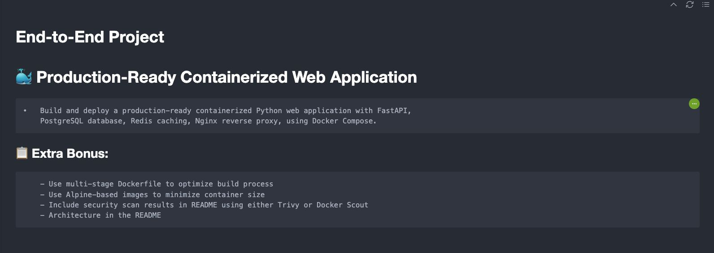
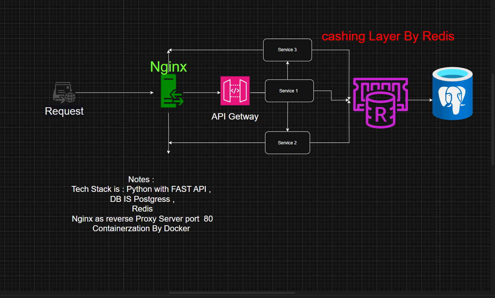

# FastAPI Demo Application

A production-ready containerized Python web application using FastAPI, PostgreSQL, Redis, and Nginx.

## Features

- FastAPI backend with automatic API documentation
- PostgreSQL database for persistent storage
- Redis for caching
- Nginx as a reverse proxy
- Docker Compose for easy deployment

## Prerequisites

- Docker
- Docker Compose

## Project Structure

```
.
├── app/
│   ├── main.py         # FastAPI application
│   ├── models.py       # Database models
│   └── cache.py        # Redis cache utilities
├── nginx/
│   └── nginx.conf      # Nginx configuration
├── Dockerfile          # Application container
├── docker-compose.yml  # Service orchestration
└── requirements.txt    # Python dependencies
```

## Getting Started

1. Clone the repository
2. Build and start the containers:
   ```bash
   docker-compose up --build
   ```

3. Access the application:
   - API: http://localhost
   - API Documentation: http://localhost/docs

## API Endpoints

- `GET /`: Welcome message
- `POST /users/`: Create a new user
- `GET /users/{username}`: Get user by username
- `GET /users/`: List all users

## Development

The application is configured for development with hot-reloading. Any changes to the Python files will automatically restart the application.

## Production Considerations

For production deployment:
1. Change the database credentials
2. Configure proper SSL/TLS in Nginx
3. Set up proper environment variables
4. Consider adding rate limiting
5. Implement proper security measures
